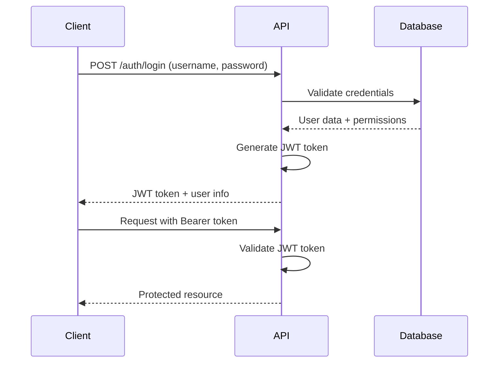
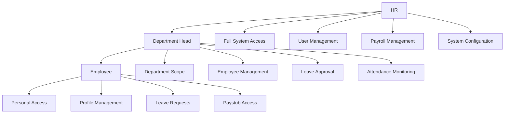

# 🔐 API Authentication and Security

This document provides comprehensive information about authentication, authorization, and security features in the TITO HR Management System API.

## 🔑 Authentication Overview

The TITO HR API uses JWT (JSON Web Token) based authentication with role-based access control (RBAC). All protected endpoints require a valid JWT token in the Authorization header.

### Authentication Flow



## 🎫 JWT Token Structure

### Access Token
```json
{
  "header": {
    "alg": "HS256",
    "typ": "JWT"
  },
  "payload": {
    "sub": "user-uuid",
    "username": "hr@company.com",
    "role": "hr",
    "permissions": ["read", "write", "admin"],
    "iat": 1643284800,
    "exp": 1643371200,
    "iss": "tito-hr-api",
    "aud": "tito-hr-client"
  }
}
```

### Refresh Token
```json
{
  "header": {
    "alg": "HS256",
    "typ": "JWT"
  },
  "payload": {
    "sub": "user-uuid",
    "type": "refresh",
    "iat": 1643284800,
    "exp": 1643889600,
    "iss": "tito-hr-api",
    "aud": "tito-hr-client"
  }
}
```

## 🔐 Authentication Endpoints

### POST /auth/login
Authenticate user and receive JWT tokens.

**Request:**
```json
{
  "username": "hr@company.com",
  "password": "securepassword"
}
```

**Response:**
```json
{
  "success": true,
  "data": {
    "token": "eyJhbGciOiJIUzI1NiIsInR5cCI6IkpXVCJ9...",
    "refreshToken": "eyJhbGciOiJIUzI1NiIsInR5cCI6IkpXVCJ9...",
    "user": {
      "id": "550e8400-e29b-41d4-a716-446655440000",
      "username": "hr@company.com",
      "role": "hr",
      "permissions": ["read", "write", "admin"]
    },
    "expiresIn": 86400
  }
}
```

**Security Features:**
- Password hashing with bcrypt
- Account lockout after 5 failed attempts
- Rate limiting: 10 requests per minute per IP
- Session tracking and monitoring

### POST /auth/refresh
Refresh expired access token using refresh token.

**Request:**
```json
{
  "refreshToken": "eyJhbGciOiJIUzI1NiIsInR5cCI6IkpXVCJ9..."
}
```

**Response:**
```json
{
  "success": true,
  "data": {
    "token": "eyJhbGciOiJIUzI1NiIsInR5cCI6IkpXVCJ9...",
    "expiresIn": 86400
  }
}
```

**Security Features:**
- Refresh token rotation
- Rate limiting: 20 requests per minute per IP
- Token blacklisting on refresh

### POST /auth/logout
Logout user and invalidate tokens.

**Headers:**
```
Authorization: Bearer <access-token>
```

**Response:**
```json
{
  "success": true,
  "message": "Logged out successfully"
}
```

**Security Features:**
- Token blacklisting
- Session cleanup
- Audit logging

## 👥 User Roles and Permissions

### Role Hierarchy



### HR Role Permissions
```json
{
  "role": "hr",
  "permissions": [
    "users:create",
    "users:read",
    "users:update",
    "users:delete",
    "employees:create",
    "employees:read",
    "employees:update",
    "employees:delete",
    "departments:create",
    "departments:read",
    "departments:update",
    "departments:delete",
    "payroll:create",
    "payroll:read",
    "payroll:update",
    "payroll:delete",
    "reports:generate",
    "system:configure"
  ]
}
```

### Department Head Role Permissions
```json
{
  "role": "department_head",
  "permissions": [
    "employees:read",
    "employees:update",
    "leaves:approve",
    "leaves:reject",
    "attendance:read",
    "reports:department"
  ]
}
```

### Employee Role Permissions
```json
{
  "role": "employee",
  "permissions": [
    "profile:read",
    "profile:update",
    "leaves:create",
    "leaves:read",
    "attendance:read",
    "paystubs:read"
  ]
}
```

## 🛡️ Authorization Middleware

### Role-Based Access Control
```javascript
// Example middleware implementation
function authorize(requiredRole, requiredPermissions = []) {
  return (req, res, next) => {
    const user = req.user;
    
    // Check role hierarchy
    const roleHierarchy = {
      'hr': 3,
      'department_head': 2,
      'employee': 1
    };
    
    if (roleHierarchy[user.role] < roleHierarchy[requiredRole]) {
      return res.status(403).json({
        success: false,
        message: 'Insufficient permissions',
        code: 'INSUFFICIENT_PERMISSIONS'
      });
    }
    
    // Check specific permissions
    if (requiredPermissions.length > 0) {
      const hasPermission = requiredPermissions.every(permission =>
        user.permissions.includes(permission)
      );
      
      if (!hasPermission) {
        return res.status(403).json({
          success: false,
          message: 'Missing required permissions',
          code: 'MISSING_PERMISSIONS'
        });
      }
    }
    
    next();
  };
}

// Usage examples
app.get('/hr/employees', authenticate, authorize('hr', ['employees:read']), getEmployees);
app.post('/hr/employees', authenticate, authorize('hr', ['employees:create']), createEmployee);
app.put('/department-head/leaves/:id/approve', authenticate, authorize('department_head', ['leaves:approve']), approveLeave);
```

### Resource-Based Authorization
```javascript
// Check if user can access specific resource
function canAccessResource(user, resource, action) {
  // HR can access all resources
  if (user.role === 'hr') {
    return true;
  }
  
  // Department head can access department resources
  if (user.role === 'department_head') {
    if (resource.type === 'employee' && resource.department_id === user.department_id) {
      return ['read', 'update'].includes(action);
    }
    if (resource.type === 'leave' && resource.employee.department_id === user.department_id) {
      return ['approve', 'reject'].includes(action);
    }
  }
  
  // Employee can only access own resources
  if (user.role === 'employee') {
    if (resource.user_id === user.id || resource.employee_id === user.id) {
      return true;
    }
  }
  
  return false;
}
```

## 🔒 Security Features

### Password Security
```javascript
// Password requirements
const passwordRequirements = {
  minLength: 8,
  maxLength: 128,
  requireUppercase: true,
  requireLowercase: true,
  requireNumbers: true,
  requireSpecialChars: true,
  forbiddenPatterns: [
    /password/i,
    /123456/,
    /qwerty/i
  ]
};

// Password hashing
const bcrypt = require('bcrypt');
const saltRounds = 12;

async function hashPassword(password) {
  return await bcrypt.hash(password, saltRounds);
}

async function verifyPassword(password, hash) {
  return await bcrypt.compare(password, hash);
}
```

### Account Lockout
```javascript
// Account lockout configuration
const lockoutConfig = {
  maxAttempts: 5,
  lockoutDuration: 15 * 60 * 1000, // 15 minutes
  resetAttemptsAfter: 24 * 60 * 60 * 1000 // 24 hours
};

// Lockout implementation
async function handleFailedLogin(userId) {
  const user = await User.findById(userId);
  
  user.failedAttempts = (user.failedAttempts || 0) + 1;
  user.lastFailedAttempt = new Date();
  
  if (user.failedAttempts >= lockoutConfig.maxAttempts) {
    user.lockedUntil = new Date(Date.now() + lockoutConfig.lockoutDuration);
  }
  
  await user.save();
}

async function isAccountLocked(user) {
  if (user.lockedUntil && user.lockedUntil > new Date()) {
    return true;
  }
  
  // Reset attempts after 24 hours
  if (user.lastFailedAttempt && 
      Date.now() - user.lastFailedAttempt.getTime() > lockoutConfig.resetAttemptsAfter) {
    user.failedAttempts = 0;
    user.lockedUntil = null;
    await user.save();
  }
  
  return false;
}
```

### Rate Limiting
```javascript
// Rate limiting configuration
const rateLimits = {
  login: {
    windowMs: 15 * 60 * 1000, // 15 minutes
    max: 10, // 10 attempts per window
    keyGenerator: (req) => req.ip
  },
  refresh: {
    windowMs: 15 * 60 * 1000, // 15 minutes
    max: 20, // 20 attempts per window
    keyGenerator: (req) => req.ip
  },
  general: {
    windowMs: 60 * 60 * 1000, // 1 hour
    max: 1000, // 1000 requests per hour
    keyGenerator: (req) => req.user?.id || req.ip
  }
};

// Rate limiting middleware
const rateLimit = require('express-rate-limit');

const loginLimiter = rateLimit({
  windowMs: rateLimits.login.windowMs,
  max: rateLimits.login.max,
  keyGenerator: rateLimits.login.keyGenerator,
  message: {
    success: false,
    message: 'Too many login attempts',
    code: 'RATE_LIMIT_EXCEEDED',
    retryAfter: Math.ceil(rateLimits.login.windowMs / 1000)
  }
});

app.post('/auth/login', loginLimiter, login);
```

### Token Security
```javascript
// JWT configuration
const jwtConfig = {
  accessToken: {
    secret: process.env.JWT_ACCESS_SECRET,
    expiresIn: '24h',
    algorithm: 'HS256'
  },
  refreshToken: {
    secret: process.env.JWT_REFRESH_SECRET,
    expiresIn: '7d',
    algorithm: 'HS256'
  }
};

// Token generation
function generateTokens(user) {
  const accessToken = jwt.sign(
    {
      sub: user.id,
      username: user.username,
      role: user.role,
      permissions: user.permissions
    },
    jwtConfig.accessToken.secret,
    {
      expiresIn: jwtConfig.accessToken.expiresIn,
      issuer: 'tito-hr-api',
      audience: 'tito-hr-client'
    }
  );
  
  const refreshToken = jwt.sign(
    {
      sub: user.id,
      type: 'refresh'
    },
    jwtConfig.refreshToken.secret,
    {
      expiresIn: jwtConfig.refreshToken.expiresIn,
      issuer: 'tito-hr-api',
      audience: 'tito-hr-client'
    }
  );
  
  return { accessToken, refreshToken };
}

// Token validation
function validateToken(token, type = 'access') {
  try {
    const secret = type === 'access' 
      ? jwtConfig.accessToken.secret 
      : jwtConfig.refreshToken.secret;
    
    const decoded = jwt.verify(token, secret, {
      issuer: 'tito-hr-api',
      audience: 'tito-hr-client'
    });
    
    return { valid: true, payload: decoded };
  } catch (error) {
    return { valid: false, error: error.message };
  }
}
```

## 🔍 Security Headers

### Security Headers Configuration
```javascript
const helmet = require('helmet');

app.use(helmet({
  contentSecurityPolicy: {
    directives: {
      defaultSrc: ["'self'"],
      styleSrc: ["'self'", "'unsafe-inline'"],
      scriptSrc: ["'self'"],
      imgSrc: ["'self'", "data:", "https:"],
      connectSrc: ["'self'"],
      fontSrc: ["'self'"],
      objectSrc: ["'none'"],
      mediaSrc: ["'self'"],
      frameSrc: ["'none'"]
    }
  },
  hsts: {
    maxAge: 31536000,
    includeSubDomains: true,
    preload: true
  },
  noSniff: true,
  xssFilter: true,
  referrerPolicy: { policy: 'strict-origin-when-cross-origin' }
}));
```

### CORS Configuration
```javascript
const cors = require('cors');

const corsOptions = {
  origin: function (origin, callback) {
    const allowedOrigins = [
      'https://app.tito-hr.com',
      'https://admin.tito-hr.com',
      'http://localhost:3000',
      'http://localhost:3001'
    ];
    
    if (!origin || allowedOrigins.includes(origin)) {
      callback(null, true);
    } else {
      callback(new Error('Not allowed by CORS'));
    }
  },
  credentials: true,
  methods: ['GET', 'POST', 'PUT', 'DELETE', 'OPTIONS'],
  allowedHeaders: ['Content-Type', 'Authorization', 'X-Requested-With'],
  exposedHeaders: ['X-RateLimit-Limit', 'X-RateLimit-Remaining', 'X-RateLimit-Reset']
};

app.use(cors(corsOptions));
```

## 📊 Audit Logging

### Security Event Logging
```javascript
// Audit log schema
const auditLogSchema = {
  timestamp: Date,
  userId: String,
  username: String,
  action: String,
  resource: String,
  resourceId: String,
  ipAddress: String,
  userAgent: String,
  success: Boolean,
  errorMessage: String,
  metadata: Object
};

// Audit logging middleware
function auditLog(action, resource) {
  return (req, res, next) => {
    const originalSend = res.send;
    
    res.send = function(data) {
      const auditEntry = {
        timestamp: new Date(),
        userId: req.user?.id,
        username: req.user?.username,
        action,
        resource,
        resourceId: req.params.id,
        ipAddress: req.ip,
        userAgent: req.get('User-Agent'),
        success: res.statusCode < 400,
        errorMessage: res.statusCode >= 400 ? data : null,
        metadata: {
          method: req.method,
          url: req.originalUrl,
          statusCode: res.statusCode
        }
      };
      
      // Log to audit system
      auditLogger.log(auditEntry);
      
      originalSend.call(this, data);
    };
    
    next();
  };
}

// Usage
app.get('/hr/employees', 
  authenticate, 
  authorize('hr', ['employees:read']), 
  auditLog('read', 'employees'),
  getEmployees
);
```

### Security Monitoring
```javascript
// Security event monitoring
const securityEvents = {
  FAILED_LOGIN: 'failed_login',
  ACCOUNT_LOCKED: 'account_locked',
  TOKEN_EXPIRED: 'token_expired',
  UNAUTHORIZED_ACCESS: 'unauthorized_access',
  RATE_LIMIT_EXCEEDED: 'rate_limit_exceeded',
  SUSPICIOUS_ACTIVITY: 'suspicious_activity'
};

function logSecurityEvent(eventType, details) {
  const securityLog = {
    timestamp: new Date(),
    eventType,
    details,
    severity: getEventSeverity(eventType),
    ipAddress: details.ipAddress,
    userId: details.userId
  };
  
  securityLogger.log(securityLog);
  
  // Alert on high severity events
  if (securityLog.severity === 'HIGH') {
    alertingService.sendAlert(securityLog);
  }
}

function getEventSeverity(eventType) {
  const severityMap = {
    [securityEvents.FAILED_LOGIN]: 'MEDIUM',
    [securityEvents.ACCOUNT_LOCKED]: 'HIGH',
    [securityEvents.TOKEN_EXPIRED]: 'LOW',
    [securityEvents.UNAUTHORIZED_ACCESS]: 'HIGH',
    [securityEvents.RATE_LIMIT_EXCEEDED]: 'MEDIUM',
    [securityEvents.SUSPICIOUS_ACTIVITY]: 'HIGH'
  };
  
  return severityMap[eventType] || 'LOW';
}
```

## 🛡️ Input Validation and Sanitization

### Request Validation
```javascript
const Joi = require('joi');

// Employee validation schema
const employeeSchema = Joi.object({
  name: Joi.string().min(2).max(100).required(),
  email: Joi.string().email().required(),
  position: Joi.string().min(2).max(100).required(),
  department_id: Joi.string().uuid().required(),
  hire_date: Joi.date().max('now').required(),
  base_salary: Joi.number().min(10000).max(1000000).required(),
  employment_type: Joi.string().valid('regular', 'contractual', 'jo').required(),
  phone: Joi.string().pattern(/^\+?[1-9]\d{1,14}$/).optional(),
  address: Joi.string().max(500).optional()
});

// Validation middleware
function validateRequest(schema) {
  return (req, res, next) => {
    const { error, value } = schema.validate(req.body, {
      abortEarly: false,
      stripUnknown: true
    });
    
    if (error) {
      return res.status(400).json({
        success: false,
        message: 'Validation failed',
        errors: error.details.map(detail => detail.message),
        code: 'VALIDATION_ERROR'
      });
    }
    
    req.body = value;
    next();
  };
}

// Usage
app.post('/hr/employees', 
  authenticate, 
  authorize('hr', ['employees:create']), 
  validateRequest(employeeSchema),
  createEmployee
);
```

### SQL Injection Prevention
```javascript
// Parameterized queries
async function getEmployeeById(employeeId) {
  const query = 'SELECT * FROM employees WHERE id = $1';
  const values = [employeeId];
  
  const result = await db.query(query, values);
  return result.rows[0];
}

// Input sanitization
function sanitizeInput(input) {
  if (typeof input === 'string') {
    return input
      .replace(/[<>]/g, '') // Remove potential HTML tags
      .replace(/['"]/g, '') // Remove quotes
      .trim();
  }
  return input;
}
```

## 🔐 Best Practices

### Client-Side Security
```javascript
// Secure token storage
class TokenManager {
  constructor() {
    this.accessTokenKey = 'tito_hr_access_token';
    this.refreshTokenKey = 'tito_hr_refresh_token';
  }
  
  setTokens(accessToken, refreshToken) {
    // Store in httpOnly cookies (server-side) or secure storage
    localStorage.setItem(this.accessTokenKey, accessToken);
    localStorage.setItem(this.refreshTokenKey, refreshToken);
  }
  
  getAccessToken() {
    return localStorage.getItem(this.accessTokenKey);
  }
  
  getRefreshToken() {
    return localStorage.getItem(this.refreshTokenKey);
  }
  
  clearTokens() {
    localStorage.removeItem(this.accessTokenKey);
    localStorage.removeItem(this.refreshTokenKey);
  }
  
  isTokenExpired(token) {
    try {
      const payload = JSON.parse(atob(token.split('.')[1]));
      return Date.now() >= payload.exp * 1000;
    } catch (error) {
      return true;
    }
  }
}

// Automatic token refresh
class APIClient {
  constructor(baseURL) {
    this.baseURL = baseURL;
    this.tokenManager = new TokenManager();
    this.setupInterceptors();
  }
  
  setupInterceptors() {
    // Request interceptor
    this.client.interceptors.request.use((config) => {
      const token = this.tokenManager.getAccessToken();
      if (token && !this.tokenManager.isTokenExpired(token)) {
        config.headers.Authorization = `Bearer ${token}`;
      }
      return config;
    });
    
    // Response interceptor
    this.client.interceptors.response.use(
      (response) => response,
      async (error) => {
        if (error.response?.status === 401) {
          try {
            await this.refreshToken();
            // Retry original request
            return this.client.request(error.config);
          } catch (refreshError) {
            this.tokenManager.clearTokens();
            window.location.href = '/login';
            return Promise.reject(refreshError);
          }
        }
        return Promise.reject(error);
      }
    );
  }
  
  async refreshToken() {
    const refreshToken = this.tokenManager.getRefreshToken();
    if (!refreshToken) {
      throw new Error('No refresh token available');
    }
    
    const response = await this.client.post('/auth/refresh', {
      refreshToken
    });
    
    const { token } = response.data.data;
    this.tokenManager.setTokens(token, refreshToken);
  }
}
```

### Server-Side Security
```javascript
// Environment configuration
const securityConfig = {
  jwt: {
    accessSecret: process.env.JWT_ACCESS_SECRET,
    refreshSecret: process.env.JWT_REFRESH_SECRET,
    accessExpiresIn: process.env.JWT_ACCESS_EXPIRES_IN || '24h',
    refreshExpiresIn: process.env.JWT_REFRESH_EXPIRES_IN || '7d'
  },
  bcrypt: {
    saltRounds: parseInt(process.env.BCRYPT_SALT_ROUNDS) || 12
  },
  rateLimit: {
    login: {
      windowMs: parseInt(process.env.RATE_LIMIT_LOGIN_WINDOW) || 900000, // 15 minutes
      max: parseInt(process.env.RATE_LIMIT_LOGIN_MAX) || 10
    }
  },
  cors: {
    origin: process.env.CORS_ORIGIN?.split(',') || ['http://localhost:3000'],
    credentials: true
  }
};

// Security middleware stack
app.use(helmet());
app.use(cors(securityConfig.cors));
app.use(rateLimit(securityConfig.rateLimit.login));
app.use(express.json({ limit: '10mb' }));
app.use(express.urlencoded({ extended: true, limit: '10mb' }));
```

---

**Last Updated**: January 27, 2025  
**API Version**: v1  
**Status**: ✅ **PRODUCTION READY**

